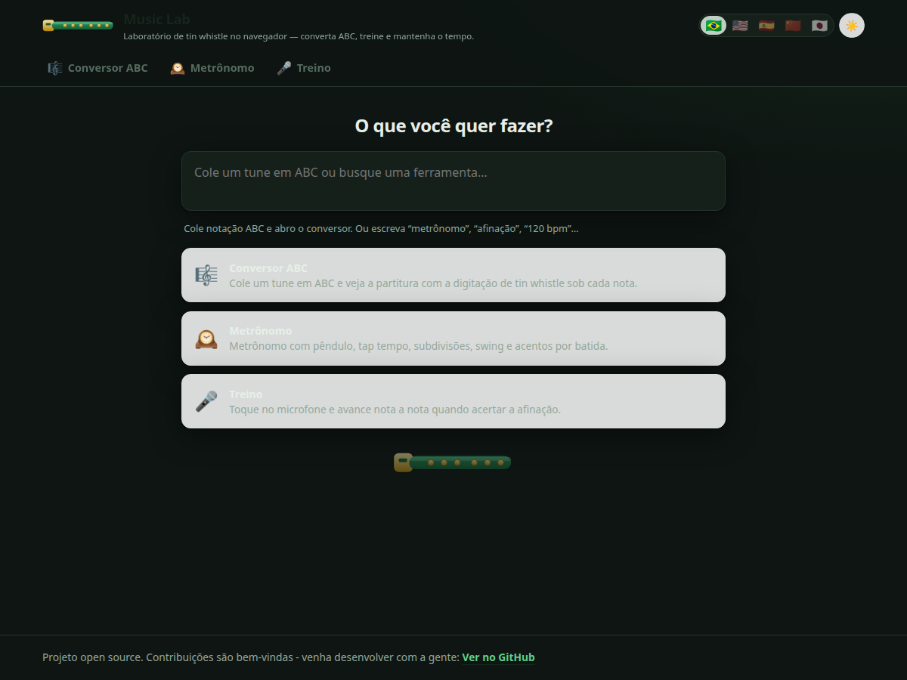
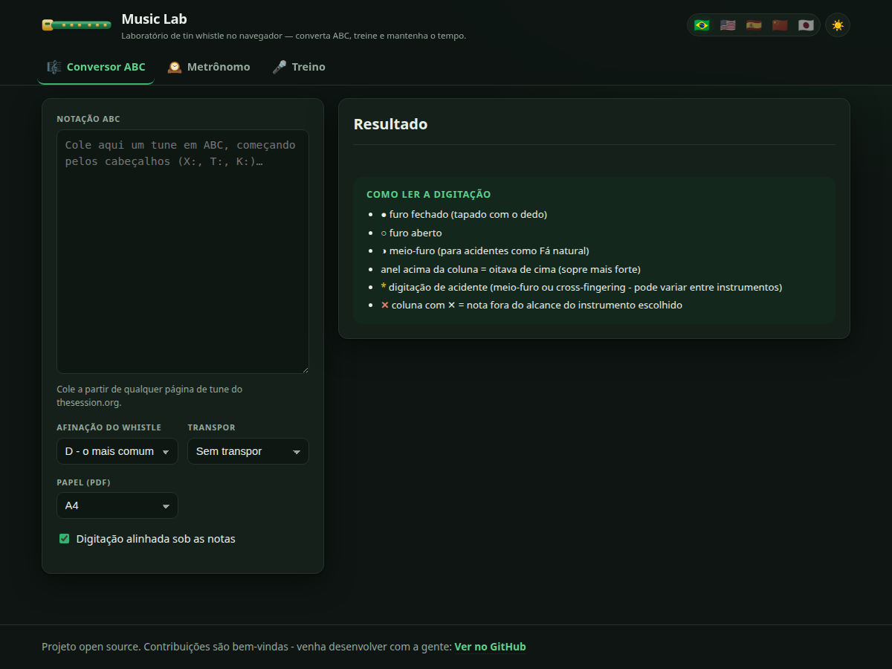
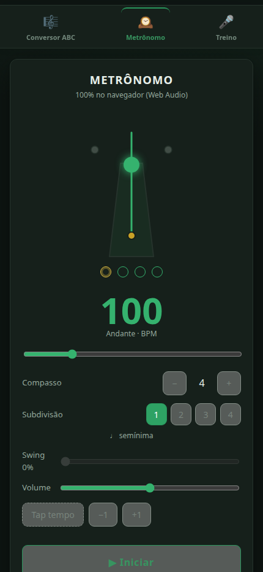
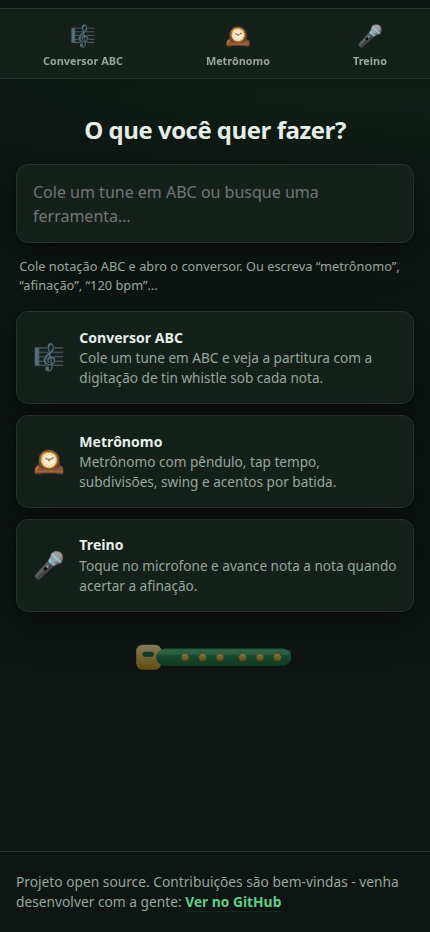

<div align="center">

# 🎼 Music Lab

**Um laboratório de tin whistle que roda inteiro no navegador.**

Conversor ABC → digitação · Afinador · Metrônomo · Treino de afinação por microfone
- quatro ferramentas numa casa só, cada uma com URL própria, 100% local, em 5 idiomas.

**▶ <https://gabrielogregorio.github.io/music-lab/>**



</div>

---

## O que tem dentro

| Rota | Ferramenta | O que faz |
|---|---|---|
| `#/` | **🔎 Launcher** | A home é um input inteligente: cole notação ABC e ele abre o **Conversor**; escreva "120 bpm" e ele abre o **Metrônomo**; ou busque uma ferramenta por palavra-chave. |
| `#/converter` | **🎼 Conversor ABC** | Cole um tune em [ABC](https://abcnotation.com/) e receba a partitura com a **digitação de tin whistle alinhada sob cada nota**. Transponha, **alongue as notas** para acalmar um tune agitado, remova ligados e exporte em SVG, PNG ou PDF. |
| `#/tuner` | **🎯 Afinador** | Afina pelo **centro** da nota, não pelo instante. Mostra a fita de história em cents (vibrato vira onda, deriva de sopro vira rampa), **mede o vibrato** (centro, largura e taxa) e traz a oitava na tela. Presets por instrumento, lá calibrável de 415 a 466 Hz. |
| `#/metronome` | **🕰️ Metrônomo** | Pêndulo dançante, tap tempo, subdivisões, swing e acento por batida. Timing *sample-accurate* via Web Audio. |
| `#/practice` | **🎤 Treino** | Toque no microfone e avance nota a nota **só quando acertar a afinação** (detecção de pitch NSDF, tolerância em cents, pauta em SVG). |

<div align="center">




 

</div>

O Conversor é a reencarnação moderna do velho `abcconverter.php` do mandolintab.net
(morto desde 2012). O Metrônomo e o Treino foram **absorvidos** de dois apps irmãos
([origens abaixo](#origens)) e reescritos/adaptados para viver aqui dentro. O
Afinador nasceu aqui.

## Destaques

- **Cada app tem URL própria** por *hash routing* (`#/converter`, `#/metronome`,
  `#/practice`) - funciona num host estático sem nenhuma reescrita de servidor.
- **Home inteligente**: detecta ABC e tempo colados e roteia sozinho; senão filtra
  as ferramentas por palavra-chave (busca full-text local, sem servidor de busca).
- **Alongar notas** (Conversor): soma tempos à duração de cada nota (+1, +2, +4, +5
  ou −1) para transformar um tune agitado em algo mais calmo - com `L:1/8`, uma
  colcheia em +1 vira uma semínima. Dá também para **remover os ligados**.
- **O afinador julga pelo centro** - um sopro varre dezenas de cents por ciclo de
  vibrato. Testar o valor instantâneo reprova quem está certo e ensina o músico a
  soprar torto para agradar a tela; aqui um vibrato de ±40 ¢ centrado no alvo
  aparece como **afinado**, com o gesto medido ao lado ("centro −3 ¢ · ±39 ¢ a
  6,0 Hz"). O que trava é o veredito, não o traço.
- **5 idiomas** - 🇧🇷 Português · 🇺🇸 English · 🇪🇸 Español · 🇨🇳 中文 · 🇯🇵 日本語.
  O idioma fica salvo no navegador.
- **Mobile-first** - no celular a navegação vira uma *tab bar* fixa embaixo.
- **Visual de tin whistle Feadóg** - verde com detalhes em **latão**, sempre no
  tema claro; a pauta, a tablatura e o pentagrama ficam num "papel" branco para
  as notas pretas continuarem legíveis.
- **100% no navegador** - sem backend, sem telemetria, sem chamada de rede.

## Stack

- **React 19 + TypeScript** com **Vite**.
- **abcjs** - renderiza a pauta em SVG e faz o transpose visual (Conversor).
- **jsPDF** - export em PDF (Conversor).
- **Web Audio API** - motor do Metrônomo e captura do microfone no Treino (sem deps).
- **Vitest** - testes das partes puras (parser ABC, transforms de duração/ligados,
  digitação, timing, detecção do launcher).
- Deploy: **GitHub Pages via Actions** (`.github/workflows/deploy.yml`).

## Rodando localmente

```bash
npm install
npm run dev      # servidor de desenvolvimento
npm test         # testes unitários (Vitest) - 181 testes
npm run build    # tsc --noEmit && vite build -> dist/
```

## Estrutura

```
src/
  main.tsx, App.tsx        raiz React + shell (header, nav, footer)
  i18n/i18n.tsx            dicionários dos 5 idiomas + provider React (useT / useI18n)
  app/
    router.ts             hash router + canal launcher→módulo (pendingAbc / pendingTempo)
    registry.ts           catálogo dos apps (nav + launcher)
    detect.ts             heurísticas puras do launcher (looksLikeAbc, detectTempo)  [testado]
    theme.ts              lockLightTheme() - o app é travado no tema claro
  shell/                  TopBar (idiomas), Nav, Launcher (a home), WhistleMark (marca SVG)
  modules/
    converter/            Conversor ABC → digitação (React sobre os cores abaixo)
    tuner/                Afinador: core/ (YIN, cents, estabilização, vibrato)      [testado]
                          + audio/ (worklet coletor → worker YIN) + UI em canvas
    metronome/            Metronome.tsx (UI + rAF) + core/ (timing/áudio puro)         [testado]
    practice/             Treino: audio/ (pitch NSDF), music/, hooks/, components/      [testado]
  music/                  leitura de ABC, alturas, armadura + transform.ts (durações,
                          ligados)                                                     [testado]
  whistle/                tabela de digitação, mapeamento e render SVG da tablatura     [testado]
  ui/                     alignedTab (injeção alinhada) + export SVG/PNG/PDF
  styles/global.css       tema tin whistle (verde Feadóg + latão), mobile-first
test/                     testes unitários + as duas Drowsy Maggie como fixtures
docs/img/                 screenshots usados neste README
```

## Como cada peça funciona

- **Digitação alinhada** (Conversor): cada diagrama fica exatamente sob a nota
  correspondente na pauta usando a geometria do próprio abcjs (`.abcjs-note`,
  `.abcjs-staff-wrapper`) - alinhamento exato, não estimado. Uma única tabela
  cromática serve para qualquer afinação: todo whistle de 6 furos é o mesmo
  instrumento deslocado em altura (`offset = altura − tônica do whistle`, 0–24).
- **Alongar notas / remover ligados** (Conversor): são transforms de *texto* sobre o
  ABC (`src/music/transform.ts`), aplicados antes do abcjs **e** do parser - assim a
  partitura e a digitação nunca saem de sincronia. `adjustDurations` soma N
  unidades (a unidade é o `L:` do tune) à duração de cada nota e pausa, tratando
  frações (`A/2`→`A3/2`) e acordes (o acorde estica como um bloco, não nota a nota);
  cabeçalhos, tuplets, campos inline e decorações passam intactos. `removeSlurs`
  tira slurs `( )` e ties `-`, preservando marcadores de quiáltera como `(3`.
- **Afinador**: YIN (difference function + CMNDF + interpolação parabólica) num
  **worker**, alimentado por um **AudioWorklet** que só coleta - o YIN não cabe nos
  ~2,7 ms do bloco de áudio, e análise lenta tem que virar pitch atrasado, nunca
  glitch. A janela sai da nota mais grave do preset (**3 períodos**, a régua do
  Praat), então escolher o instrumento é escolher a latência: ~7 ms num whistle em
  Ré, contra ~62 ms no modo cromático. Tudo é medido em **cents**, não em Hz. O
  veredito passa por deadband assimétrico + dwell + latch - display contínuo e
  evento de confirmação são coisas diferentes.
- **Timing do Metrônomo**: scheduler de *lookahead* (Chris Wilson, "A Tale of Two
  Clocks") - um timer grosso em Web Worker agenda os clicks no relógio de amostras;
  o visual é drenado por `ctx.currentTime − outputLatency`, então o flash bate com o
  som ouvido.
- **Treino**: mic → `AnalyserNode` → detecção de pitch por NSDF/McLeod (JS puro); a
  nota avança quando o pitch fica na tolerância pelo tempo de sustentação exigido.

## Deploy no GitHub Pages

O workflow em `.github/workflows/deploy.yml` roda os testes, faz o build e publica
`dist/` no Pages a cada push na `main`. Habilite Pages com fonte **GitHub Actions**.
O `base: "/music-lab/"` do Vite precisa casar com o caminho do repositório no Pages
(`usuario.github.io/music-lab/`). Se renomear o repo, atualize `base` no `vite.config.ts`.

## Origens

Music Lab reúne três projetos, mais uma ferramenta que nasceu aqui:

- **Whistle ABC** - o conversor ABC → digitação de tin whistle (base deste repo).
- **MusicStudio** - o metrônomo (Web Audio, pêndulo SVG).
- **Perfect Partituras** - o treino de afinação por microfone (detecção NSDF).
- **Afinador** - sem ancestral: escrito para este repo a partir da pesquisa
  acumulada sobre afinadores web (DSP, captura, produto e acessibilidade).

A migração para React e a unificação estão registradas no [CHANGELOG](CHANGELOG.md).

## Licença

MIT.
